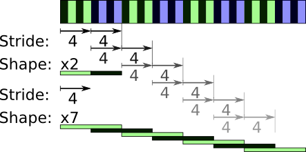

Robert (Kern)'s nasty stride trick
===================================

.. warning::

    Parents guidance: not for underaged children

**Problem** Sliding average, but we don't want copies.

We want to take a sliding average of a, on a window of size 2::

    >>> import numpy as np
    >>> a = np.arange(8)
    >>> a
    array([0, 1, 2, 3, 4, 5, 6, 7])
    >>> a.strides
    (4,)

We are going to create improbable strides and shapes (numpy 1.2)::

    >>> from numpy.lib import stride_tricks
    >>> b = stride_tricks.as_strided(a, shape=(2, 7), strides=(4, 4))
    >>> b
    array([[0, 1, 2, 3, 4, 5, 6],
           [1, 2, 3, 4, 5, 6, 7]])

Overlapping dimensions!

Easy, now all we have to do is sum along the axis 0::

    >>> b.sum(axis=0)
    array([ 1,  3,  5,  7,  9, 11, 13])

