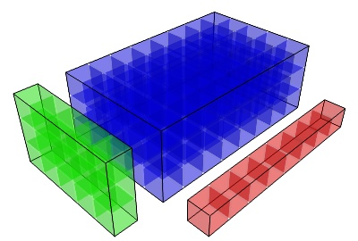
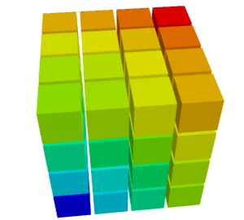
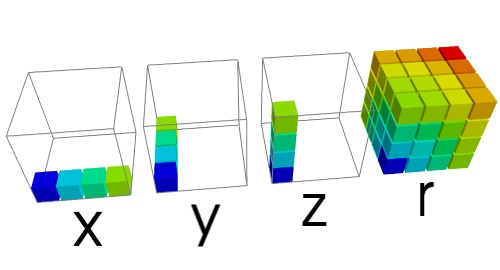
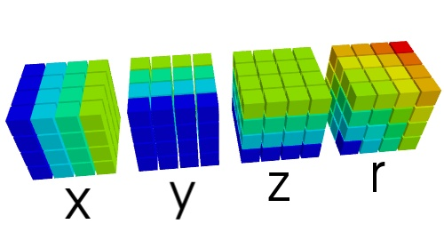

.. _broadcasting:

Broadcasting
=============

Broadcasting definition
-------------------------

Applying operators on arrays of different shapes:

* Adding a scalar and an array of course works::

    >>> import numpy as np
    >>> a = np.ones((3, ))
    >>> a
    array([ 1.,  1.,  1.])
    >>> a + 1
    array([ 2.,  2.,  2.])

* What about adding (or multiplying) two arrays of different shape? ::

    >>> b = 2*np.ones((2, 1))
    >>> b
    array([[ 2.],
           [ 2.]])
    >>> a + b
    array([[ 3.,  3.,  3.],
           [ 3.,  3.,  3.]])

.. topic:: **Broadcasting rules**: 

    * Element-wize operations on arrays: 

    * Compare dimensions, starting from last

    * Dimension of size 1 are extrapolated.

Applications
------------

 * Yet another way of avoiding loops
 
 * Decreases memory consumption

Creating a 3D grid of size n
.............................

|3d_radius| ::

    np.sqrt(x**2 + y**2 + z**2)

:Without broadcasting:

      |3d_radius_non_broadcasting| ::

        >>> x, y, z = np.mgrid[-100:100, -100:100, -100:100]
        >>> print x.shape, y.shape, z.shape
        (200, 200, 200) (200, 200, 200) (200, 200, 200)
        >>> r = np.sqrt(x**2 + y**2 + z**2)

      These three lines take **2.3s**: the creation of `x`, `y`, `z` takes
      0.5s, and the calculation of `r` takes 1.8s.

      The total memory used is 64Mb per array. There are 4 named arrays
      (`x`, `y`, `z`) and at least 2 temporary arrays are created. Thus
      around **400Mb** are used.

      Squaring each array take 200^3 operations, as well as the two
      additions, and the call to `np.sqrt`. Thus a total of **48 million
      operations**.

.. 

:With broadcasting:

      |3d_radius_broadcasting| ::

        >>> x, y, z = np.ogrid[-100:100, -100:100, -100:100]
        >>> print x.shape, y.shape, z.shape
        (200, 1, 1) (1, 200, 1) (1, 1, 200)
        >>> r = np.sqrt(x**2 + y**2 + z**2)

      These lines take **1.1s** second, with only 6ms to create the arrays.

      The three input arrays take only 1.6Kb. The output array 64Mb, and
      there is not more than a 64Mb and a 320kb temporary array created.
      Around **120Mb** are used.

      Squaring each array takes 200 operations, the first addition is
      200^2 = 40 thousands operations, and the second, as well as the
      call to `np.sqrt`, is 200^3 = 8 million operations. Thus around
      **16 million operations** are performed. 

Looking at the relative timings between non-broadcasted and broadcasted
versions, we can see that they do not scale proportionally to the number
of operations. Broadcasting does take some time.

Monte-Carlo density evaluation
................................

Density evaluation of `f = A sin(k1 X) + B sin(k2 Y)` using the
probability distribution of `A`, `B`, `X` and `Y`.

Strategy: sample `f` with huge arrays of the random variables, and build
an histogram of the results.

With broadcasting, sample `n` values for each `A`, `B`, `X` and `Y`,
along a different direction each time. `n^4` samples for `f`.

.. warning::

    Unwanted correlations are introduced between the random variables.
