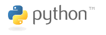

Introduction to Python for Science
==========================================

.. topic:: Why Python 
   
    * Efficient coding: what is the point of very fast simulations, if it
      takes longer to write them than to run them?

    * Full-fledge, non-specialized, programming language.

    * Communication: code should read like a book.

    * Code that we understand: developing an intuition, an understanding
      of the algorithms through exploratory coding and interaction.

**Core scientific libraries**

==========   ============================================
numpy	      http://www.scipy.org/Download
----------   --------------------------------------------
ipython	      http://ipython.scipy.org/
----------   --------------------------------------------
matplotlib    http://matplotlib.sourceforge.net/
----------   --------------------------------------------
scipy	      http://www.scipy.org/Download
----------   --------------------------------------------
mayavi	      http://code.enthought.com/projects/mayavi
==========   ============================================

Installing with distributions: 
    * EPD: http://www.enthought.com/products/epd.php
    * Python(x,y): http://www.pythonxy.com

:Resources:

    * http://docs.scipy.org/

    * *Python Scripting for Computational Science*,
      Hans Petter Langtangen, Springer

    * *Beginning Python visualization*,
      Shai Vaingast, Apress

__________

.. raw:: html
    
    <b>Layout of the tutorial</b>

.. toctree::
    :maxdepth: 1

    workflow.rst
    python_language.rst
    control_flow.rst
    functions.rst

.. raw:: latex

   \twocolumn

