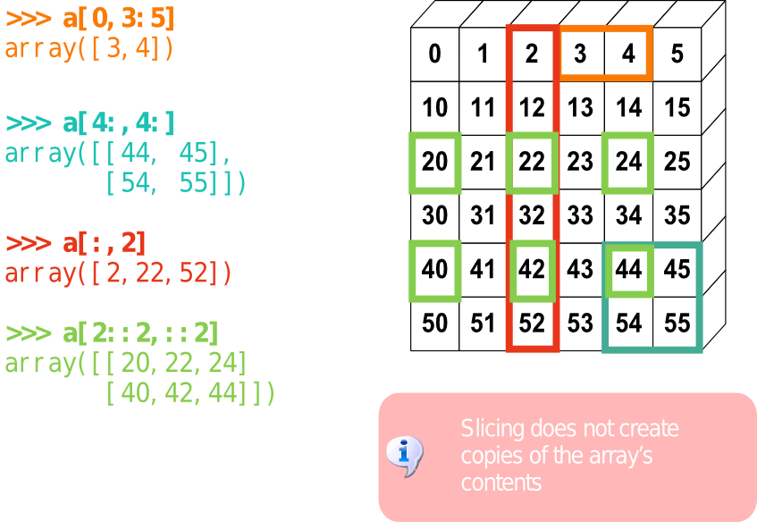
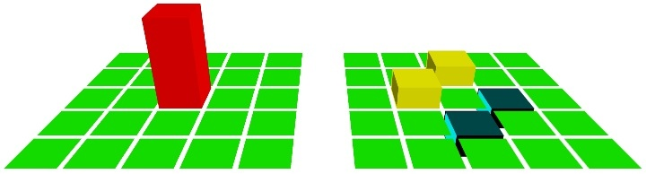
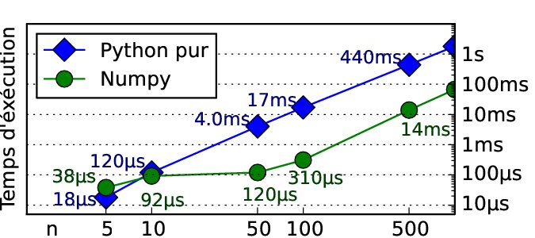
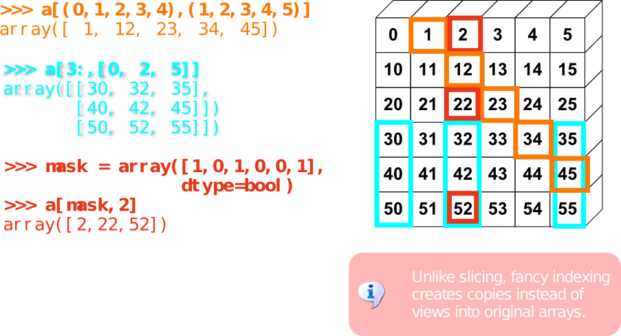
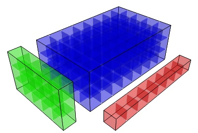
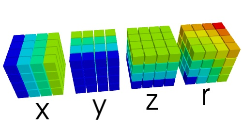
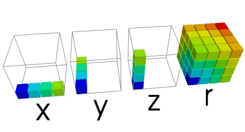

===================================
Numpy: array computing
===================================

.. topic:: Conventions
    
    ::

     >>> import numpy as np
     >>> import scipy as sp
     >>> import pylab as pl

Array computing
============================

    +--------------------------+-------------------------------------+
    | Python                   | numpy                               |
    +--------------------------+-------------------------------------+
    | List:  `a = [1, 2, 3]`   | Tableau:  `a = np.array([1, 2, 3])` |
    +--------------------------+-------------------------------------+

Doing operations on many numbers
---------------------------------------------

* Standard numerical computing = loops

  ::

    def square(data):
        for i in range(len(data)):
            data[i] = data[i]**2
        return data

  .. sourcecode:: ipython

    In [1]: %timeit data = range(1000) ; square(data)
    1000 loops, best of 3: 314 us per loop

* Vector computing: loops are replace by vector operations, on arrays

  ::

    def square(data):
        return data**2

  .. sourcecode:: ipython

    In [2]: %timeit data=np.arange(1000) ; square(data)
    100000 loops, best of 3: 10.6 us per loop

Multidimensional arrays
-----------------------------

::

    >>> a = np.arange(10)
    >>> a
    array([0, 1, 2, 3, 4, 5, 6, 7, 8, 9])
    >>> b = np.reshape(a, (2, 5))
    >>> b
    array([[0, 1, 2, 3, 4],
           [5, 6, 7, 8, 9]])
    >>> b[:, 1]
    array([1, 6])

Creating arrays
---------------------

* With constants::

    >>> np.ones((2, 3))
    array([[ 1.,  1.,  1.],
           [ 1.,  1.,  1.]])

* Arrays contain typed entries::

    >>> np.ones(3, dtype=np.int)
    array([1, 1, 1])

* Creating a grid::

    >>> x, y = np.indices((2, 2))
    >>> x
    array([[0, 0],
           [1, 1]])
    >>> y
    array([[0, 1],
           [0, 1]])
    >>> x+1j*y
    array([[ 0.+0.j,  0.+1.j],
           [ 1.+0.j,  1.+1.j]])

Slicing
---------

Multidimensionel traversing arrays

An example: calculating the laplacian
----------------------------------------------

::

    image[1:-1, 1:-1] = (image[:-2, 1:-1] - image[2:, 1:-1] +
                         image[1:-1, :-2] - image[1:-1, 2:])*0.25

.. sourcecode:: ipython

    In [3]: import pylab as pl
    In [4]: l = sp.lena()
    In [5]: pl.imshow(l, cmap=pl.cm.gray())
    In [6]: e = l[:-2, 1:-1] - l[2:, 1:-1] + l[1:-1, :-2] - l[1:-1, 2:]
    In [7]: pl.imshow(e, pl.cm.gray())

.. plot:: lena_laplacien.py 
    :hide-links:
    :align: center

____

    **Gains en temps**

Advanced indexing
==================

With integers or masks

With integer arrays
------------------------------------

.. 
   >>> np.random.seed(4)

* Example: sorting a vector with another one::

    >>> a, b = np.random.random_integers(10, size=(2, 4)) 
    >>> a
    array([8, 6, 2, 9])
    >>> b
    array([ 8,  9,  3, 10])
    >>> a_order = np.argsort(a)
    >>> a_order
    array([2, 1, 0, 3])
    >>> b[a_order]
    array([ 3,  9,  8, 10])

Using masks
-------------------------

* Zeroing out all the even elements of a table::

    >>> a = np.arange(10)
    >>> a
    array([0, 1, 2, 3, 4, 5, 6, 7, 8, 9])
    >>> a[a % 2] = 0
    >>> a
    array([0, 0, 2, 3, 4, 5, 6, 7, 8, 9])

* Applying a mask to a grid to select the center of an image:

  .. sourcecode:: ipython

    In [8]: n, m = l.shape
    In [9]: x, y = np.indices((n, m))
    In [10]: distances = np.sqrt((x - 0.5*n)**2 + (y - 0.5*m)**2)
    In [11]: l[distance > 200] = 255
    In [12]: pl.imshow(l, cmap=pl.cm.gray)

.. plot:: lena_mask.py 
    :hide-links:
    :scale: 75
    :align: center 

Broadcasting
================

Multidimensional operations
-------------------------------

* You can add a numer to an array::

    >>> a = np.ones((3, ))
    >>> a
    array([ 1.,  1.,  1.])
    >>> a + 1
    array([ 2.,  2.,  2.])

* And what if we add two arrays of different shapes? ::

    >>> b = 2*np.ones((2, 1))
    >>> b
    array([[ 2.],
           [ 2.]])
    >>> a + b
    array([[ 3.,  3.,  3.],
           [ 3.,  3.,  3.]])

* Dimensions are matched::

Pour la performance
-------------------

* Creation d'une grille 3D

  .. image:: 3d_radius.jpg
    :align: center

  ::

    np.sqrt(x**2 + y**2 + z**2)

____

         

:Sans broadcasting:

      .. raw:: latex

         \rule{0pt}{2em}

      ::

        >>> x, y, z = np.mgrid[-100:100, -100:100, -100:100]
        >>> print x.shape, y.shape, z.shape
        (200, 200, 200) (200, 200, 200) (200, 200, 200)
        >>> r = np.sqrt(x**2 + y**2 + z**2)

      * Temps : **2.3s**: création de `x`, `y`, `z`: 0.5s, calcul de `r`: 1.8s

      * Mémoire : 64Mo par tableaux, 6 tableaux,
        (`x`, `y`, `z`, `r`) et 2 temporaires 

        => **400Mb**

      * 200^3 opérations élémentaires par opération de tableaux: 
      
        **48 million d'opérations**.

____

         
:Avec broadcasting:

      .. raw:: latex

         \rule{0pt}{2em}

      ::

        >>> x, y, z = np.ogrid[-100:100, -100:100, -100:100]
        >>> print x.shape, y.shape, z.shape
        (200, 1, 1) (1, 200, 1) (1, 1, 200)
        >>> r = np.sqrt(x**2 + y**2 + z**2)

      * Temps : **1.1s**: création de `x`, `y`, `z`: 6ms

      * Mémoire: `x`, `y`, `z` : 1.6Kb. `r` : 64Mo, et 1 temporaire de 64Mo
        
        => **120Mb**

      * **16 million d'opérations** 

.. raw:: html

   <br\>
   &nbsp;
   <br\>

.. topic:: `numpy`: une view structurée sur la mémoire avec des opérations

  * données identiques (`dtype`)
  * indexage rapide
  * vue/copies
  * reshape pas couteux
  * opérations comprenant la forme des tableaux

.. :vim:spell:
   :vim:spelllang=fr:

